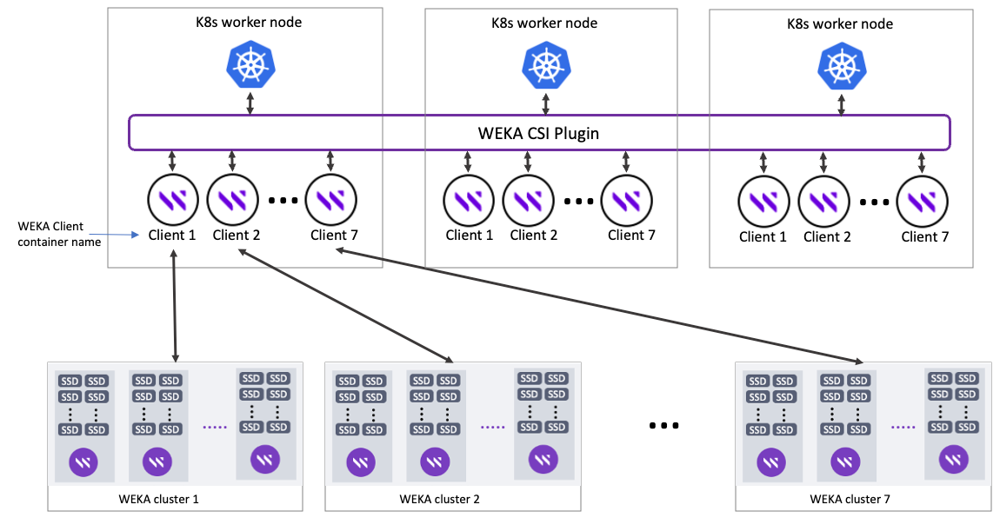

# Storage class configurations

The Weka CSI Plugin supports the following persistent volume types:

* **Dynamic:** Persistent Volume Claim (PVC).
* **Static:** Persistent Volume (PV).

The Weka CSI Plugin communicates with the WEKA cluster using REST API, leveraging this integration to provide extended capabilities, such as strictly enforcing volume capacity usage through integration with filesystem directory quota functionality. For details, see [Quota management](https://docs.weka.io/weka-filesystems-and-object-stores/quota-management/).

Starting from CSI Plugin **v2.0,** three StorageClass configurations are available:

* Directory-backed StorageClass
* Snapshot-backed StorageClass
* Filesystem-backed StorageClass

## API-based communication model

In the API-based model, the API endpoint addresses and authentication credentials must be provided to the WEKA CSI Plugin to establish a REST API connection with the WEKA cluster and perform configuration tasks.

The information is stored securely in [Kubernetes secret](https://kubernetes.io/docs/concepts/configuration/secret/), referred to by the Storage Class.

Adhere to the following:

* The configuration described in this section applies to WEKA CSI Plugin version **0.8.4** and higher. To get all features, WEKA CSI Plugin version **2.0** is required.
* Directory quota integration requires WEKA cluster version **3.13.0** and higher.
* Snapshot quota integration requires WEKA cluster version **4.2** and higher.
* Authenticated mounts for filesystems set with `auth-required=true`, and filesystems in the non-root organization, require WEKA cluster version **3.14.0** and higher.

**Note**: The legacy communication model is deprecated and will be removed in the next release. If you are using the legacy communication model, replacing it with the API-based one is recommended.


## Prerequisites

* To provision any persistent volume type, a Storage Class must exist in Kubernetes deployment that matches the secret name and namespace in the WEKA cluster configuration.
* For directory-backed and snapshot-backed storage class configurations, a filesystem must be pre-created on the WEKA cluster to create PVCs.
* For the filesystem-backed StorageClass configuration, the filesystem name is generated automatically based on the PVC name, but the filesystem group name must be declared in the Storage Class configuration.

## Configure secret data

1. Create a secret data file (see the following example).

<details>

<summary>Example: csi-wekafs-api-secret.yaml file</summary>

```
apiVersion: v1
kind: Secret
metadata:
  name: csi-wekafs-api-secret
  namespace: csi-wekafs
type: Opaque
data:
  # A username to connect to the cluster API (base64-encoded)
  username: YWRtaW4=
  # A password to connect to the cluster API (base64-encoded)
  password: YWRtaW4=
  # An organization to connect to (default Root, base64-encoded)
  organization: Um9vdA==
  # A comma-separated list of cluster management endpoints. Format: <IP:port> (base64-encoded)
  # It is recommended to configure at least 2 management endpoints (cluster backend nodes), or a load-balancer if used
  # e.g. 172.31.15.113:14000,172.31.12.91:14000
  endpoints: MTcyLjMxLjQxLjU0OjE0MDAwLDE3Mi4zMS40Ny4xNTI6MTQwMDAsMTcyLjMxLjM4LjI1MDoxNDAwMCwxNzIuMzEuNDcuMTU1OjE0MDAwLDE3Mi4zMS4zMy45MToxNDAwMCwxNzIuMzEuMzguMTU1OjE0MDAwCg==
  # protocol to use for API connection (may be either http or https, base64-encoded)
  scheme: aHR0cA==
  # for multiple clusters setup, set a specific container name (base64-encoded)
  localContainerName: ""
  # for cloud deployments with automatic healing and auto-scaling, set to "true" to enable automatic updates of the endpoints.
  # The API endpoints will be updated automatically on first connection to the cluster API, as well as on each re-login
  # maybe either (true/false), base64-encoded
  # NOTE: if a load balancer is used to access the cluster API, leave this setting as "false"
  autoUpdateEndpoints: ZmFsc2U=
  # It is recommended to configure all NFS server IP addresses to better share the load/balance the traffic.
  # NOTE: this setting is optional and should be used only when the NFS Group IP addresses are not set in the cluster
  # WARNING: providing a load balancer IP address that uses NFS connection redirects (also known as `referrals`) to other servers is not supported.
  # e.g. 10.100.100.1,10.100.100.2
  nfsTargetIps: ""
  # When using HTTPS connection and self-signed or untrusted certificates, provide a CA certificate in PEM format, base64-encoded
  # for cloud deployments or other scenarios where setting an NFS Group IP addresses is not possible,
  # provide a comma-separated list of NFS target IP addresses in form of <IP> (base64-encoded)
  # caCertificate: <base64-encoded-PEM>
  caCertificate: ""

```

</details>

2. Apply the secret data and validate it is created successfully.

<details>

<summary>Apply the yaml file</summary>

```
# apply the secret .yaml file
$ kubectl apply -f csi-wekafs-api-secret.yaml

# Check the secret was successfully created
$ kubectl get secret csi-wekafs-api-secret -n csi-wekafs
NAME                    TYPE     DATA   AGE
csi-wekafs-api-secret   Opaque   5      7m
```

</details>

**Note**: To provision CSI volumes on filesystems residing in non-root organizations or filesystems, set with `auth-required=true`. A CSI Plugin of version **0.8.4** and higher and WEKA cluster version **3.14** and higher are required.

#### Secret data parameters

All values in the secret data file must be in base64-encoded format.

<table><thead><tr><th width="232">Key</th><th>Description</th><th>Comments</th></tr></thead><tbody><tr><td><code>username</code></td><td>The user name for API access to the WEKA cluster.</td><td><p>To run the CSI Plugin in a non-default organization, OrgAdmin permission is required. In other cases, ClusterAdmin permission is required.</p><p>It is recommended that you create a separate user for the CSI Plugin. See [User management] (https://docs.weka.io/operation-guide/user-management).</p></td></tr><tr><td><code>password</code></td><td>The user password for API access to the WEKA cluster.</td><td></td></tr><tr><td><code>organization</code></td><td>The WEKA organization name for the user.<br>For a single organization, use <code>Root</code>.</td><td>You can use multiple secrets to access multiple organizations, which are specified in different storage classes.</td></tr><tr><td><code>scheme</code></td><td>The URL scheme that is used for communicating with the WEKA cluster API.</td><td><code>http</code> or <code>https</code> can be used. The user must ensure that the Weka cluster was configured to use the same connection scheme.</td></tr><tr><td><code>endpoints</code></td><td><p>Comma-separated list of endpoints consisting of IP address and port. For example, </p><p><code>172.31.15.113:14000,172.31.12.91:14000</code></p></td><td>For redundancy, specify the management IP addresses of at least 2 backend servers.</td></tr><tr><td><code>localContainerName</code></td><td>WEKA client container name for the client connected to the relevant WEKA cluster.<br><strong>Only required when connecting a K8s worker node to multiple WEKA clusters</strong>.<br>For a single cluster, do not set this parameter.</td><td><p>All local container names relevant to a specific WEKA cluster must be the same across all k8s worker nodes.</p><p>For details, see <a href="storage-class-configurations.md#connect-k8s-worker-nodes-to-multiple-weka-clusters">Connect k8s worker nodes to multiple WEKA clusters</a></p></td></tr><tr><td><code>autoUpdateEndpoints</code></td><td>Specify whether the WEKA CSI Plugin performs automatic periodic updates of API endpoints (<code>true</code> or <code>false</code>).</td><td><p>In cloud-based clusters with automatic scaling and healing, the IP addresses of management containers can change over time. To prevent losing API connectivity, the plugin can automatically retrieve all management container IP addresses from the cluster at login.</p><p>If using an external load balancer, set this option to <code>false</code>.</p></td></tr><tr><td><code>nfsTargetIps</code></td><td>A comma-separated list of IP addresses to use when publishing volumes over NFS.</td><td>Normally, the system automatically retrieves IP addresses from the interface group defined on the WEKA cluster, leaving this parameter empty. However, if no Virtual IP addresses are set on the interface group (for example, in cloud environments), manually provide the IP addresses in this parameter.</td></tr><tr><td><code>caCertificate</code></td><td>custom CA certificate used to generate the HTTPS certificate for the WEKA cluster. The certificate must be in PEM format and Base64-encoded. </td><td>As of WEKA version 4.3.0, HTTPS communication is mandatory. To ensure a secure connection without bypassing certificate checks, it's recommended to provide the certificate file within a secret.</td></tr></tbody></table>

## Connect K8s worker nodes to multiple WEKA clusters

A single K8s worker node can be connected to multiple WEKA clusters (maximum 7 clusters) simultaneously.


k8s worker nodes connected to multiple WEKA clusters

#### Procedure

1. For each k8s worker node, create a number of WEKA client containers according to the number of clusters you want to connect to.\
   The WEKA client container name must be according to the WEKA cluster that is connected to. For example, to connect to 7 WEKA clusters, it is required to create 7 WEKA client containers named client 1, client 2, and so on.
2. Create secret data files for each WEKA cluster. In the `localContainerName` set the relevant client container name. For example, for client 1 set the name of the client container connected to cluster 1.
3. Configure storage classes using the relevant secret data file.

**Note**: Filesystem names used for k8s (defined in the storage classes) must be unique across all clusters.

**Related topic**

[Mount filesystems from multiple clusters on a single client](https://docs.weka.io/weka-filesystems-and-object-stores/mounting-filesystems/mount-filesystems-from-multiple-clusters-on-a-single-client)

## Configure directory-backed StorageClass

1. Create a directory-backed storage class yaml file (see the following example).

<details>

<summary>Example: storageclass-wekafs-dir-api.yaml</summary>

```yaml
apiVersion: storage.k8s.io/v1
kind: StorageClass
metadata:
  name: storageclass-wekafs-dir-api
provisioner: csi.weka.io
reclaimPolicy: Delete
volumeBindingMode: Immediate
allowVolumeExpansion: true
parameters:
  volumeType: dir/v1
  filesystemName: default
  capacityEnforcement: HARD
  # optional parameters setting UID, GID and permissions on volume
  # UID of the volume owner, default 0 (root)
  #ownerUid: "1000"
  # GID of the volume owner, default 0 (root)
  #ownerGid: "1000"
  # permissions in Unix octal format, default "0750"
  #permissions: "0775"
  # name of the secret that stores API credentials for a cluster
  # change the name of secret to match secret of a particular cluster (if you have several Weka clusters)
  csi.storage.k8s.io/provisioner-secret-name: &secretName csi-wekafs-api-secret
  # change the name of the namespace in which the cluster API credentials
  csi.storage.k8s.io/provisioner-secret-namespace: &secretNamespace csi-wekafs
  # do not change anything below this line, or set to same parameters as above
  csi.storage.k8s.io/controller-publish-secret-name: *secretName
  csi.storage.k8s.io/controller-publish-secret-namespace: *secretNamespace
  csi.storage.k8s.io/controller-expand-secret-name: *secretName
  csi.storage.k8s.io/controller-expand-secret-namespace: *secretNamespace
  csi.storage.k8s.io/node-stage-secret-name: *secretName
  csi.storage.k8s.io/node-stage-secret-namespace: *secretNamespace
  csi.storage.k8s.io/node-publish-secret-name: *secretName
  csi.storage.k8s.io/node-publish-secret-namespace: *secretNamespace

```

</details>

2. Apply the directory-backed storage class and validate it is created successfully.

<details>

<summary>Apply the yaml file</summary>

```
# apply the storageclass .yaml file
$ kubectl apply -f storageclass-wekafs-dir-api.yaml
storageclass.storage.k8s.io/storageclass-wekafs-dir-api created

# check the storageclass resource has been created successfully 
$ kubectl get sc
NAME                           PROVISIONER         RECLAIMPOLICY   VOLUMEBINDINGMODE   ALLOWVOLUMEEXPANSION   AGE
storageclass-wekafs-dir-api    csi.weka.io         Delete          Immediate           true                   75s
```

</details>

Adhere to the following:

* You can define multiple storage classes different filesystem groups for filesystem backups.
* You can use the same secret for multiple storage classes, as long as the credentials are valid to access the filesystem.
* You can use several secret data files for different organizations on the same WEKA cluster, or for different WEKA clusters spanning across the same Kubernetes cluster.

#### Directory-backed StorageClass **parameters**

<table><thead><tr><th width="293">Parameter</th><th>Description</th></tr></thead><tbody><tr><td><code>filesystemName</code></td><td><p>The name of the WEKA filesystem to create directories as Kubernetes volumes.</p><p>The filesystem must exist on the WEKA cluster.</p><p>The filesystem may not be defined as authenticated.</p></td></tr><tr><td><code>capacityEnforcement</code></td><td><p>Possible values: <code>HARD</code> or <code>SOFT</code>.</p><ul><li><code>HARD</code>: Strictly enforce quota and deny any write operation to the persistent volume consumer until space is freed.</li><li><code>SOFT</code>: Do not strictly enforce the quota. If the quota is reached, create an alert on the WEKA cluster.</li></ul></td></tr><tr><td><code>ownerUid</code></td><td>Effective User ID of the owner user for the provisioned CSI volume. Might be required for application deployments running under non-root accounts.<br>Defaults to <code>0 CSI plugin v2.0 adds fsgroup features so this is optional</code><strong>.</strong></td></tr><tr><td><code>ownerGid</code></td><td>Effective Group ID of the owner user for the provisioned CSI volume. Might be required for application deployments running under non-root accounts.<br>Defaults to <code>0 CSI plugin v2.0 adds fsgroup features so this is optional</code>.</td></tr><tr><td><code>permissions</code></td><td>Unix permissions for the provisioned volume root directory in octal format. It must be set in quotes. Defaults to <code>0775</code></td></tr><tr><td><code>csi.storage.k8s.io/provisioner-secret-name</code></td><td><p>Name of the K8s secret. For example, <code>csi-wekafs-api-secret</code>.</p><p>It is recommended to use a trust anchor definition to avoid mistakes because the same value (<code>&#x26;secretName</code>) must be specified in the additional parameters according to the CSI specifications.<br>Format: see <em>Example: storageclass-wekafs-dir-api.yaml</em> above (the additional parameters appear at the end of the example).</p></td></tr><tr><td><code>csi.storage.k8s.io/provisioner-secret-namespace</code></td><td><p>The namespace the secret is located in.</p><p>The secret may reside in the CSI plugin namespace or a different one.</p><p>It is recommended to use a trust anchor definition to avoid mistakes because the same value (<code>&#x26;secretNamespace</code>) must be specified in the additional parameters according to the CSI specifications.<br>Format: see <em>Example: storageclass-wekafs-dir-api.yaml</em> above (the additional parameters appear at the end of the example).</p></td></tr></tbody></table>

## Configure snapshot-backed StorageClass

1. Create a snapshot-backed StorageClass yaml file (see the following example).

<details>

<summary>Example: storageclass-wekafs-snap-api.yaml</summary>

```yaml
apiVersion: storage.k8s.io/v1
kind: StorageClass
metadata:
  name: storageclass-wekafs-snap-api
provisioner: csi.weka.io
reclaimPolicy: Delete
volumeBindingMode: Immediate
allowVolumeExpansion: true
parameters:
  volumeType: weka/v2  # this line can be ommitted completely

  # name of an EMPTY filesystem to provision volumes on
  filesystemName: default

  # name of the secret that stores API credentials for a cluster
  # change the name of secret to match secret of a particular cluster (if you have several Weka clusters)
  csi.storage.k8s.io/provisioner-secret-name: &secretName csi-wekafs-api-secret
  # change the name of the namespace in which the cluster API credentials
  csi.storage.k8s.io/provisioner-secret-namespace: &secretNamespace csi-wekafs
  # do not change anything below this line, or set to same parameters as above
  csi.storage.k8s.io/controller-publish-secret-name: *secretName
  csi.storage.k8s.io/controller-publish-secret-namespace: *secretNamespace
  csi.storage.k8s.io/controller-expand-secret-name: *secretName
  csi.storage.k8s.io/controller-expand-secret-namespace: *secretNamespace
  csi.storage.k8s.io/node-stage-secret-name: *secretName
  csi.storage.k8s.io/node-stage-secret-namespace: *secretNamespace
  csi.storage.k8s.io/node-publish-secret-name: *secretName
  csi.storage.k8s.io/node-publish-secret-namespace: *secretNamespace
```

</details>

2. Apply the snapshot-backed StorageClass and validate it is created successfully.

<details>

<summary>Apply the yaml file</summary>

```
# apply the storageclass.yaml file
$ kubectl apply -f storageclass-wekafs-snap-api.yaml
storageclass.storage.k8s.io/storageclass-wekafs-snap-api created

# check the storageclass resource has been created successfully 
$ kubectl get sc
NAME                           PROVISIONER         RECLAIMPOLICY   VOLUMEBINDINGMODE   ALLOWVOLUMEEXPANSION   AGE
storageclass-wekafs-snap-api   csi.weka.io         Delete          Immediate           true                   75s
```

</details>

Adhere to the following:

* You can define multiple storage classes with different filesystems.
* You can use the same secret for multiple storage classes, as long as the credentials are valid to access the filesystem.
* You can use several secret data files for different organizations on the same WEKA cluster, or for different WEKA clusters spanning across the same Kubernetes cluster.

#### snapshot-backed StorageClass parameters

<table><thead><tr><th width="257">Parameter</th><th>Description</th></tr></thead><tbody><tr><td><code>volumeType</code></td><td><p>The CSI Plugin volume type.</p><p>For snapshot-backed StorageClass configurations, use <code>weka/v2</code>.</p></td></tr><tr><td><code>filesystemName</code></td><td><p>The name of the WEKA filesystem to create snapshots as Kubernetes volumes.</p><p>The filesystem must exist on the WEKA cluster and be empty.</p></td></tr><tr><td><code>csi.storage.k8s.io/provisioner-secret-name</code></td><td><p>Name of the K8s secret. For example, <code>csi-wekafs-api-secret</code>.</p><p>It is recommended to use a trust anchor definition to avoid mistakes because the same value must be specified in the additional parameters according to the CSI specifications.<br>Format: see <em>Example: storageclass-wekafs-snap-api.yaml</em> above (the additional parameters appear at the end of the example).</p></td></tr><tr><td><code>csi.storage.k8s.io/provisioner-secret-namespace</code></td><td><p>The namespace the secret is located in.</p><p>The secret must be located in a different namespace than the installed CSI Plugin.</p><p>It is recommended to use a trust anchor definition to avoid mistakes because the same value must be specified in the additional parameters according to the CSI specifications.<br>Format: see <em>Example: storageclass-wekafs-snap-api.yaml</em> above (the additional parameters appear at the end of the example).</p></td></tr></tbody></table>

## Configure filesystem-backed StorageClass

1. Create a filesystem-backed StorageClass yaml file (see the following example).

<details>

<summary>Example: storageclass-wekafs-fs-api.yaml</summary>

```yaml
apiVersion: storage.k8s.io/v1
kind: StorageClass
metadata:
  name: storageclass-wekafs-fs-api
provisioner: csi.weka.io
reclaimPolicy: Delete
volumeBindingMode: Immediate
allowVolumeExpansion: true
parameters:
  volumeType: weka/v2  # this line can be ommitted completely

  # name of the filesystem group to create FS in.
  filesystemGroupName: default
  # minimum size of filesystem to create (preallocate space for snapshots and derived volumes)
  initialFilesystemSizeGB: "100"

  # name of the secret that stores API credentials for a cluster
  # change the name of secret to match secret of a particular cluster (if you have several Weka clusters)
  csi.storage.k8s.io/provisioner-secret-name: &secretName csi-wekafs-api-secret
  # change the name of the namespace in which the cluster API credentials
  csi.storage.k8s.io/provisioner-secret-namespace: &secretNamespace csi-wekafs
  # do not change anything below this line, or set to same parameters as above
  csi.storage.k8s.io/controller-publish-secret-name: *secretName
  csi.storage.k8s.io/controller-publish-secret-namespace: *secretNamespace
  csi.storage.k8s.io/controller-expand-secret-name: *secretName
  csi.storage.k8s.io/controller-expand-secret-namespace: *secretNamespace
  csi.storage.k8s.io/node-stage-secret-name: *secretName
  csi.storage.k8s.io/node-stage-secret-namespace: *secretNamespace
  csi.storage.k8s.io/node-publish-secret-name: *secretName
  csi.storage.k8s.io/node-publish-secret-namespace: *secretNamespace

```

</details>

2. Apply the filesystem-backed StorageClass and validate it is created successfully.

<details>

<summary>Apply the yaml file</summary>

```
# apply the storageclass.yaml file
$ kubectl apply -f storageclass-wekafs-fs-api.yaml
storageclass.storage.k8s.io/storageclass-wekafs-fs-api created

# check the storageclass resource has been created successfully 
$ kubectl get sc
NAME                           PROVISIONER         RECLAIMPOLICY   VOLUMEBINDINGMODE   ALLOWVOLUMEEXPANSION   AGE
storageclass-wekafs-fs-api     csi.weka.io         Delete          Immediate           true                   75s
```

</details>

Adhere to the following:

* You can define multiple storage classes with different filesystems.
* You can use the same secret for multiple storage classes, as long as the credentials are valid to access the filesystem.
* You can use several secret data files for different organizations on the same WEKA cluster, or for different WEKA clusters spanning across the same Kubernetes cluster.

#### filesystem-backed StorageClass **parameters**

<table><thead><tr><th width="282">Parameter</th><th>Description</th></tr></thead><tbody><tr><td><code>volumeType</code></td><td><p>The CSI Plugin volume type.</p><p>For filesystem-backed StorageClass configurations, use <code>weka/v2</code>.</p></td></tr><tr><td><code>filesystemGroupName</code></td><td>The name of the WEKA filesystem to create filesystems as Kubernetes volumes.<br>The filesystem group must exist on the WEKA cluster.</td></tr><tr><td><code>initialFilesystemSizeGB</code></td><td><p>The default size to create new filesystems.<br>Set this parameter in the following cases:</p><ul><li>When the PVC requested size is smaller than the specified value.</li><li>For additional space required by snapshots of a volume or snapshot-backed volumes derived from this filesystem.</li></ul></td></tr><tr><td><code>csi.storage.k8s.io/provisioner-secret-name</code></td><td><p>Name of the K8s secret. For example, <code>csi-wekafs-api-secret</code>.</p><p>It is recommended to use a trust anchor definition to avoid mistakes because the same value must be specified in the additional parameters below, according to the CSI specifications.<br>Format: see <em>Example: storageclass-wekafs-snap-api.yaml</em> above (the additional parameters appear at the end of the example).</p></td></tr><tr><td><code>csi.storage.k8s.io/provisioner-secret-namespace</code></td><td><p>The namespace the secret is located in.</p><p>The secret must be located in a different namespace than the installed CSI Plugin.</p><p>It is recommended to use a trust anchor definition to avoid mistakes because the same value must be specified in the additional parameters according to the CSI specifications.<br>Format: see <em>Example: storageclass-wekafs-fs-api.yaml</em> above (the additional parameters appear at the end of the example).</p></td></tr></tbody></table>
